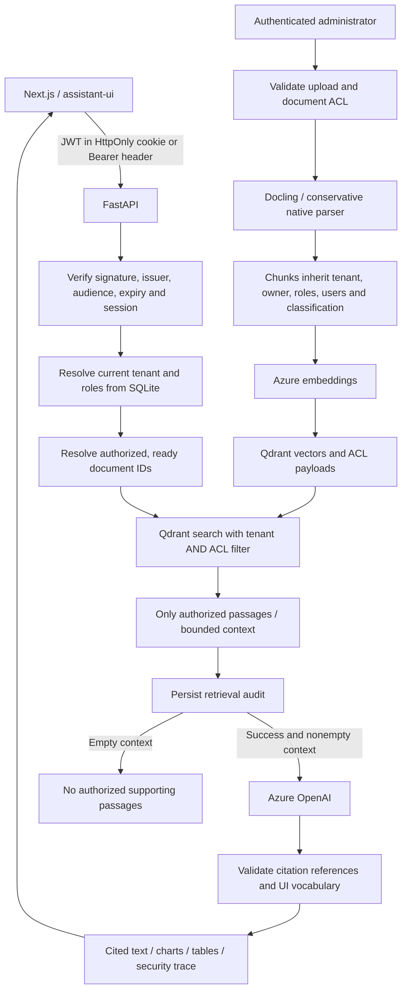

# Folio: Zero Trust RAG

Authorization is enforced before any chunk enters model context. The API and
Qdrant enforce access; the LLM does not decide permissions.



## Access policy

```text
document.tenant_id == user.tenant_id
AND (
  document.owner_id == user.user_id
  OR user.user_id IN document.allowed_users
  OR intersection(user.roles, document.allowed_roles) is nonempty
)
```

Tenant membership alone never grants access. Missing ACL metadata denies access.
Admin permits user provisioning, upload and ACL management for accessible documents;
it does not silently grant read access to every document. Classification is a label,
not an additional clearance system. Policies are inherited by all document chunks.

## Boundaries implemented

- JWT: fixed HS256 algorithm, required claims, issuer/audience/expiry validation,
  server-side session lookup and current user roles on each content request.
- Passwords: unique salt and scrypt; one-hour, revocable HttpOnly/SameSite=Strict
  sessions; a per-account sign-in attempt limit. Credentials are never in URL parameters.
- Ingestion: admin only; server assigns owner and tenant, validates explicit users
  within the tenant, and includes access policy in duplicate identity.
- Retrieval: intersects authorized ready-document scope with Qdrant tenant/ACL
  predicates. No unauthorized top-k search followed by application filtering.
- Document list, detail, original download, query scope and user listing enforce
  access. Unauthorized direct document IDs receive the same 404 as missing IDs.
- ACL changes update Qdrant and catalog chunks. Their intersection denies stale
  grants while an update is in progress; active ingestion cannot change policy.
- Audit records identity, keyed query hash, retrieved IDs, counts and timestamp
  before model invocation. Write failure prevents generation. `/audit` returns
  only the requesting user's events; traces omit unauthorized names and counts.
- Generative UI shares the authorized context and citation boundary. Empty
  context skips generation. Previously disclosed content in a conversation is
  not retroactively erased by revoking future access.

## Current storage and scope

SQLite holds accounts, sessions, the document manifest, chunk previews and audit
events. Qdrant holds vectors and inherited ACL payloads. PostgreSQL is a future
migration; this implementation does not claim PostgreSQL RLS. Azure remains the
existing generation and embedding provider; Ollama is not implemented.

This is a local portfolio/reference application. Complete first-run setup on a
loopback-bound API; the first account owns existing unassigned local documents.
Deploying publicly needs managed provisioning/SSO, HTTPS with secure cookies,
operational controls and an independent security review. Audit rows are durable
locally but not tamper-evident to a database administrator. This is not a claim
that ACLs solve prompt injection in documents the user is allowed to read.

Retrieval authorization is a request snapshot: an already-started generation may
finish after a concurrent permission change. Citation validation establishes
reference validity, not factual entailment. Chat history remains browser memory.

## Reference documentation

- [Qdrant filtering](https://qdrant.tech/documentation/search/filtering/)
- [PyJWT validation API](https://pyjwt.readthedocs.io/en/latest/api.html)

Tests cover tenant isolation, explicit grants, owner access, JWT tampering,
expiration, unsigned tokens, audience checks, revocation, direct downloads,
admin-only ingestion, role injection, inaccessible malicious documents, and audit
failure. Browser tests use a deterministic model with real local Qdrant; they do
not establish live Azure behavior.
