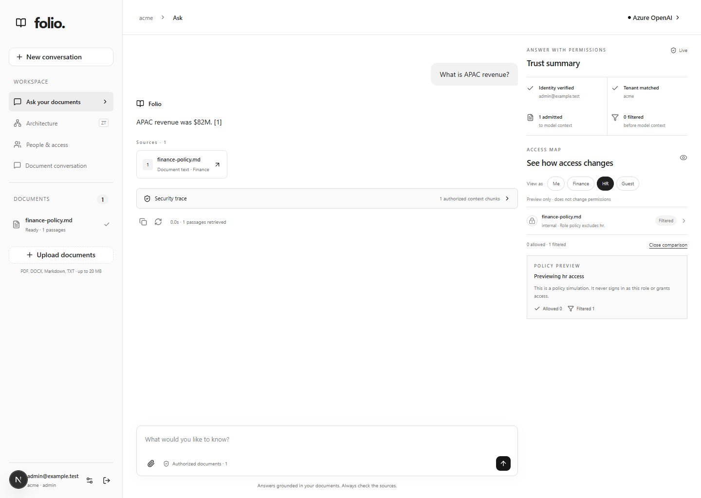

# Folio / Zero-Trust RAG

Ask questions across company documents while keeping the business boundary intact:
people only receive answers from documents they are allowed to see, and every answer
shows the evidence and permission decision behind it.



## Why this matters to the business

Most RAG demos answer the question first and treat access control as a separate
application concern. That creates a costly failure mode: a useful answer can still
leak a confidential document. Folio makes authorization part of the answer path.

| Business question | Folio behavior |
| --- | --- |
| Can this person ask about this information? | The signed-in identity and tenant are checked first. |
| Which documents can the system use? | Retrieval is filtered by owner, role, or explicit person access before the model sees context. |
| Can a manager trust the answer? | The answer includes source passages, a security trace, and an inline Trust summary. |
| What happens when access changes? | Document permissions are inherited by chunks and applied to future retrieval and downloads. |
| Can we explain a denial? | The Access Map shows allowed or filtered policy outcomes without exposing hidden document names. |

## How the architecture works, simply

1. **A person signs in.** Folio verifies the account, tenant, and current roles.
2. **The business policy runs before search.** The system applies
   `tenant AND (owner OR role OR explicit user)` to the vector search.
3. **Only permitted passages reach Azure OpenAI.** If nothing is authorized, Folio
   stops before generation instead of asking the model to guess.
4. **The answer returns with proof.** Users can inspect citations, source excerpts,
   admitted and filtered passage counts, and the retrieval audit event.
5. **Permissions remain operational.** Upload ACLs, document updates, downloads,
   and chunk records use the same policy, so access does not drift between screens.

The frontend is a focused workspace for asking, inspecting, and previewing policy.
FastAPI owns identity, admission, retrieval, and audit. SQLite stores the local
manifest and security records; Qdrant stores vectors with inherited ACL fields;
Azure OpenAI supplies embeddings and grounded answer generation. See
[ARCHITECTURE.md](ARCHITECTURE.md) for the implementation boundaries and limits.

## Run locally

Requires Python 3.11–3.13, [uv](https://docs.astral.sh/uv/getting-started/installation/),
Node.js 20.9+, and Azure OpenAI **chat and embedding deployments**.

From the project root, in PowerShell:

```powershell
uv sync --locked
if (-not (Test-Path .env)) { Copy-Item .env.example .env }
```

Fill in `.env` locally:

```dotenv
AZURE_OPENAI_ENDPOINT=https://YOUR-RESOURCE.openai.azure.com
AZURE_OPENAI_API_KEY=YOUR_KEY
AZURE_OPENAI_CHAT_DEPLOYMENT=YOUR_CHAT_DEPLOYMENT
AZURE_OPENAI_EMBEDDING_DEPLOYMENT=YOUR_EMBEDDING_DEPLOYMENT
```

Use Azure **deployment names**, which may differ from model names. A complete
`https://…/openai/v1/` URL is also accepted. For older deployment-based endpoints,
set `AZURE_OPENAI_API_VERSION` and use the resource root URL. Embeddings can use a
separate resource with `AZURE_OPENAI_EMBEDDING_ENDPOINT` and
`AZURE_OPENAI_EMBEDDING_API_KEY`.
See [Microsoft's endpoint guide](https://learn.microsoft.com/en-us/azure/developer/ai/how-to/switching-endpoints).
Restart the API after changing `.env`. Never put keys in `NEXT_PUBLIC_*` variables.

Verify both deployments with tiny synthetic requests (incurs normal Azure usage):

```powershell
uv run python -m scripts.check_azure
uv run uvicorn backend.main:app --host 127.0.0.1 --port 8000
```

In another terminal:

```powershell
cd frontend
npm.cmd ci
npm.cmd run dev
```

Open **http://127.0.0.1:3000**. If that port is busy, use `npm.cmd run dev -- --port 3001`
and open **http://127.0.0.1:3001**. Create your workspace's first administrator;
existing unassigned local documents become private to that account. Complete this
first setup on the loopback-bound app. No default accounts or passwords are supplied.

Upload `examples/quarterly-report.md`, wait for Ready,
and ask “What was APAC revenue?” Click a source card to inspect the excerpt or
download the original. The example is fictional and is not automatically loaded.
API documentation: **http://127.0.0.1:8000/docs**.

Qdrant defaults to persistent local storage under `.data/qdrant`; no Docker is
required. To use a separate Qdrant server:

```powershell
docker compose up -d
```

Set `QDRANT_URL=http://localhost:6333` and restart the API. Server and local mode
use separate storage; upload documents again after switching. Run a **single API
worker** in local mode because embedded Qdrant holds a filesystem lock.

## What works

- Conservative native-text parsing for simple PDFs; Docling for complex PDFs
  and DOCX, with OCR enabled when native text coverage is insufficient.
- Headings, PDF page provenance, Markdown tables, and picture captions retained.
- Background ingestion: queued → parsing → chunking → waiting for embeddings →
  embedding → indexing → ready. One parsing worker overlaps one embedding/indexing
  worker, with at most five active documents.
- Per-stage and total processing times in document details. Identical uploads
  reuse an active or ready job instead of parsing and embedding again.
- Approximately 650-token prose chunks; tables stay whole (up to 6,000 tokens).
- Azure embedding batches and Qdrant cosine retrieval, default top 5.
- Answers cite numbered sources; unknown/missing citation references are rejected.
- Source drawer, original downloads, per-document indexed passage inspection.
- assistant-ui conversations, copy, retry, cancellation, and streamed progress events.
- Persistent uploads, vectors and a SQLite document manifest. Chats are in memory
  and are cleared on page refresh. Each question is retrieved independently;
  conversational follow-up resolution is not implemented yet.

The answer is returned **after** citation validation. Progress streams, but answer
tokens are not streamed before validation. Cancelling stops browser consumption;
an already-started Azure request may still finish and incur usage.

## Parsing and retrieval limits

Docling downloads its PDF/OCR models on the first PDF that needs it. This can take several
minutes and needs network access; DOCX does not need the PDF models. Scanned PDF
quality depends on OCR. Current limits: 20 MB/file, 200 PDF pages, 2,000 chunks/file,
five queued/active uploads, and a 12,000-token retrieved context budget. Very large
tables fail explicitly instead of silently losing rows. Merged table cell semantics
can be lossy in Markdown. DOCX/Markdown/TXT citations do not invent page numbers.

Chart captions are indexed; chart pixels are **not** interpreted. When a question
asks for a chart or table, grounded numeric values present in retrieved text may
be rendered as an assistant-ui chart/table; the model cannot execute generated
React and unsupported UI specs are discarded. If Azure returns a cited Markdown
numeric table instead of the UI JSON, an explicit chart request uses that table
as a safe bar-chart fallback.
Citation validation checks that references exist, not that every claim follows
from the cited text. Model hallucinations and document prompt injection still need
evaluation. The similarity threshold is configurable and not a confidence score.

This is a local application with JWT sessions, roles, tenant isolation,
document ACLs and retrieval audit. Public deployment needs HTTPS, managed account
provisioning, operational controls and an independent security review.
Uploaded excerpts and questions are sent to your configured Azure resources.
PostgreSQL, vision processing, reranking, durable workers and persisted chat history
are subsequent milestones. The original files and manifest live under `.data`.

## Zero Trust workspace

The interface uses white, grey and black throughout, including charts. Open
**Architecture** to inspect the request path and each enforced boundary. While
asking a question, the right-hand **Trust summary** and **Access Map** stay
visible beside the answer so the permission decision can be inspected in place.

1. In **People & access**, an administrator creates a user with an employee,
   finance, HR, engineering or admin role. All accounts created here belong to
   the administrator's tenant.
2. **Upload documents** opens a permissions panel. Choose classification, roles
   and optional people. Without grants, the document is private to its owner.
3. Each chunk inherits the tenant and document ACL. Similarity retrieval includes
   `tenant AND (owner OR role OR explicit user)` inside Qdrant.
4. Use **View as** in the Access Map to preview how Finance, HR or Guest policy
   would filter the documents visible in the current workspace. This is a
   client-side policy preview; it never signs in as another user or grants access.
   For a real identity comparison, sign out and sign in as another user. Query-only
   users see only shared documents. No authorized context means no model or chart
   generation.
5. Expand **Security trace** below an answer to see the verified identity,
   policy, authorized scope, context count and persisted audit ID.
6. An administrator can change an accessible document's permissions in its
   details drawer after ingestion completes. Future retrieval and downloads
   immediately use the updated policy.

Accounts and salted scrypt password hashes, sessions and audit live in SQLite;
vectors and inherited ACLs live in Qdrant. Admin controls management actions,
but reading still requires the document's ACL. JWTs are stored in HttpOnly,
SameSite=Strict cookies, expire after one hour, and are revoked on sign-out.
Bearer JWTs are also accepted. The API reloads current tenant/roles from its database.

`AUTH_JWT_SECRET` is optional. Set a random secret of at least 32 characters in
the backend environment for stable signing across restarts. When omitted, a new
in-memory key invalidates previous sessions at restart. Use
`AUTH_COOKIE_SECURE=true` with HTTPS; configure `AUTH_ALLOWED_ORIGINS` as a JSON
array when serving the UI from another origin. Preserve the existing `.env`.

Audit records use a keyed query hash rather than raw questions. Your own latest
50 events are available at authenticated `GET /audit`. The LLM sees only authorized
passages, including for charts and tables. This reduces unauthorized disclosure;
it does not solve malicious instructions inside otherwise accessible documents.
See [the full architecture and limits](ARCHITECTURE.md).

## Ingestion settings

Optional settings in the root `.env` (restart the API after changes):

```dotenv
PDF_PARSING_MODE=auto
EMBEDDING_BATCH_SIZE=32
EMBEDDING_BATCH_MAX_TOKENS=24000
```

`auto` uses native extraction only for unambiguous text layouts. Images, tables,
columns, rotated text, nested forms, and uncertain reading order use Docling.
`docling` forces structure reconstruction while still selecting OCR based on
native-text coverage. Complex files can remain slow; inspect their stage timings.

Embedding requests obey both batch count and aggregate token bounds. Batches are
sent sequentially with the Azure client's bounded retries; tune within your
deployment quota. Oversized individual inputs fail before any batch is sent.

Duplicate detection includes file bytes, format, parsing mode, pipeline version,
and embedding collection identity. A duplicate keeps the original library name
and ID, even if uploaded under a different name. Failed jobs can be retried.
Files ingested before fingerprints were added need one new ingestion before reuse
is available. Timing totals include queue waits, but exclude HTTP upload transfer.

Inspect routing without Azure or changing your library:

```powershell
.venv/Scripts/python.exe -m scripts.benchmark_ingestion PATH_TO_FILE.pdf
```

Add `--live --output .scratch/ingestion-benchmark.json` for real Azure ingestion,
retrieval, citation-reference checks, and duplicate reuse in temporary storage.
This incurs normal Azure usage. Add `--mode docling` to compare routes. Reports
contain metrics, not document text; reference validity does not prove that every
answer claim is supported.

## Verify and evaluate

```powershell
uv run pytest -q
uv run ruff check backend tests scripts
cd frontend
npm.cmd run typecheck
npm.cmd run build
npm.cmd run test:e2e
```

Browser tests start isolated test servers on 3100 and 8100, use real parsing and
Qdrant, and replace only Azure with a deterministic test double. They are not a
live Azure validation. On Windows they use installed Edge; on other platforms run
`npm exec playwright install chromium` first. Stop a running frontend dev server
before browser tests because Next.js uses one dev lock per project.

Optional real two-page PDF smoke check (downloads Docling models):

```powershell
$env:RUN_PDF_SMOKE='1'
uv run pytest -q tests/test_pdf.py
```

For a live baseline, upload `examples/quarterly-report.md`, get its `document_id`
from `GET /documents`, then run from the root:

```powershell
uv run python -m scripts.evaluate --document-id YOUR_DOCUMENT_ID
```

This runs 20 synthetic questions and reports retrieval hit rate at the configured
top-k, expected-answer substring match, and citation hit rate separately. These
are simple diagnostics, not an LLM judge or a claim of semantic correctness. It
makes 20 chat calls plus embeddings. No baseline percentages are claimed until
this runs against real deployments. Add held-out documents and unanswerable
questions before optimizing chunking, embeddings or reranking.

The evaluation command requires `FOLIO_EMAIL` and `FOLIO_PASSWORD` in its process
environment for an account authorized to access the selected synthetic document.
The temporary ingestion benchmark creates an isolated administrator automatically.

## Code map

| File | Responsibility |
| --- | --- |
| `backend/parsing.py` | Structured parsing and token-bounded chunking |
| `backend/pdf_native.py` | Conservative native-PDF inspection and page provenance |
| `backend/ingestion.py` | Separate parsing and embedding workers, stage timings |
| `backend/azure.py` | Azure clients, grounded prompt, citation checks |
| `backend/vectors.py` | Qdrant storage and document-scoped retrieval |
| `backend/catalog.py` | SQLite manifest and chunk inspection |
| `backend/main.py` | Upload jobs, API, streamed query progress |
| `frontend/src/components/workspace.tsx` | Document library, assistant-ui, source drawers |

Embedding spaces are separated by resource/deployment identity. If the underlying
model behind an existing deployment name changes, change `QDRANT_COLLECTION` and
upload again. Incomplete uploads are excluded from retrieval; jobs interrupted by
a restart are marked failed and can be retried by uploading the original again.
