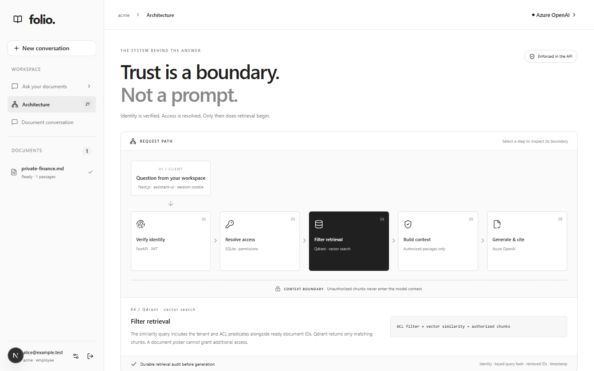
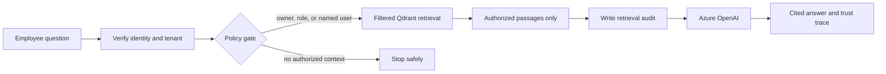

# Folio / Zero-Trust RAG

Folio lets teams ask questions across company documents without turning search into a data-leak path. Access is checked before retrieval, the model sees only authorized passages, and every answer carries evidence.




## The business case

- **Reduce disclosure risk:** private documents are removed before the model sees context.
- **Increase answer confidence:** every answer includes citations, source excerpts, and a security trace.
- **Make access explainable:** managers can see why a document was allowed or filtered without exposing hidden document names.

## The architecture gate



The gate is the product boundary:

```text
tenant AND (owner OR role OR explicit user)
```

This rule is applied in the API and Qdrant before generation. Azure OpenAI never decides who can read a document. If the gate returns no supporting passages, Folio does not call the model.

## How it works

1. A person signs in; current tenant and roles are loaded from SQLite.
2. An administrator uploads a document and assigns roles or specific people.
3. Chunks inherit the document policy when they are indexed in Qdrant.
4. A question runs through the policy gate before similarity search.
5. The answer is generated from authorized passages and returned with citations.
6. The inline **Trust summary** and **Access Map** show the decision beside the answer.

## Run locally

Requires Python 3.11–3.13, [uv](https://docs.astral.sh/uv/getting-started/installation/), Node.js 20.9+, and Azure OpenAI chat and embedding deployments.

```powershell
uv sync --locked
if (-not (Test-Path .env)) { Copy-Item .env.example .env }
```

Fill in `.env` locally:

```dotenv
AZURE_OPENAI_ENDPOINT=https://YOUR-RESOURCE.openai.azure.com
AZURE_OPENAI_API_KEY=YOUR_KEY
AZURE_OPENAI_CHAT_DEPLOYMENT=YOUR_CHAT_DEPLOYMENT
AZURE_OPENAI_EMBEDDING_DEPLOYMENT=YOUR_EMBEDDING_DEPLOYMENT
```

Start the API:

```powershell
uv run uvicorn backend.main:app --host 127.0.0.1 --port 8000
```

In another terminal:

```powershell
cd frontend
npm.cmd ci
npm.cmd run dev -- --port 3001
```

Open [http://127.0.0.1:3001](http://127.0.0.1:3001). Complete first-run setup, upload `examples/quarterly-report.md`, wait for **Ready**, and ask “What was APAC revenue?”.

Qdrant uses `.data/qdrant` by default. Run one local API process because embedded Qdrant locks its directory.

## Trust and storage

- JWT sessions are revocable and roles are reloaded on every request.
- SQLite stores accounts, document metadata, sessions, and audit records.
- Qdrant stores vectors with inherited tenant and ACL fields.
- Azure OpenAI provides embeddings and grounded answer generation.
- Uploads, the manifest, and vectors stay under `.data` and are ignored by Git.

## Current boundaries

This is a local reference application. PostgreSQL, managed SSO, durable workers, reranking, persisted chat, and live Azure browser coverage are future work. Citation checks verify that references exist; they do not prove every claim is factually supported. See [ARCHITECTURE.md](ARCHITECTURE.md) for the detailed policy and security limits.

## Verify changes

```powershell
uv run pytest -q
uv run ruff check backend tests scripts
cd frontend
npm.cmd run typecheck
npm.cmd run build -- --webpack
npm.cmd run test:e2e
```

Browser tests use isolated SQLite/Qdrant and a deterministic Azure test provider; they do not establish live Azure behavior.

## Repository map

| Area | Purpose |
| --- | --- |
| `backend/security.py` | Identity, sessions, roles, password hashing, and policy checks |
| `backend/main.py` | Upload, retrieval, audit, and API orchestration |
| `backend/ingestion.py` / `backend/parsing.py` | Parsing, chunking, embeddings, and indexing |
| `backend/vectors.py` | Qdrant storage and ACL filters |
| `frontend/src/components/workspace.tsx` | Ask workspace, sources, security trace, and Access Map |
| `frontend/e2e/` | Permission, citation, and browser journeys |
| `ARCHITECTURE.md` | Detailed flow, boundaries, and limitations |
